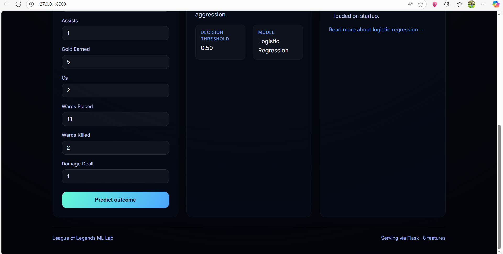

# League of Legends Win Predictor

Interactive Flask service that exposes a logistic-regression model trained on
match-level statistics to estimate a team’s chance of victory. The project ships
with a reproducible training pipeline, curated artifacts, and a polished web UI
to explore predictions.

## Project structure

```
.
├── artifacts/                     # Serialized sklearn pipeline + metadata
├── league_of_legends_data_large.csv
├── pipeline/
│   └── train_pipeline.py          # Offline training entrypoint
├── service/
│   ├── api.py                     # Flask app factory + routes
│   ├── static/
│   │   ├── app.js                 # UI logic + API integration
│   │   └── styles.css             # Dashboard styling
│   └── templates/
│       └── index.html             # HTML shell rendered by Flask
└── requirements.txt
```

## Setup

1. (Optional) Create a virtual environment.
2. Install dependencies:
   ```bash
   pip install -r requirements.txt
   ```
3. Ensure `league_of_legends_data_large.csv` exists in the project root.

## Train the pipeline

Regenerate the artifacts anytime the dataset or hyper-parameters change:

```bash
python pipeline/train_pipeline.py \
  --dataset league_of_legends_data_large.csv \
  --artifact-dir artifacts \
  --test-size 0.2 \
  --random-state 42
```

The script outputs:

- `artifacts/lol_win_pipeline.joblib`: `StandardScaler + LogisticRegression`
  pipeline.
- `artifacts/metadata.json`: feature order, target column, validation metrics.

## Run the web service

```bash
cd service
python api.py
# or: flask --app service.api run --reload
```

Visit `http://localhost:8000` to use the dashboard:

- `/` – Interactive UI with prefills and live results.
- `/predict` – JSON API that accepts all numeric features in `metadata.json`.
- `/health` – Lightweight probe for infrastructure checks.

## UI preview

| Input panel & metrics | Prediction insight |
| --- | --- |
|  |  |

## Notes

- Update `requirements.txt` and rerun the training script before deploying
  changes to production.
- The Flask factory (`create_app`) allows easy integration with WSGI servers or
  cloud platforms.
- Model accuracy/ROC AUC are displayed directly in the UI to keep stakeholders
  informed about performance.

